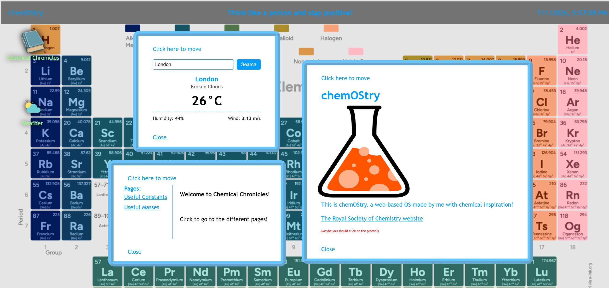

# chemOStry
chemOStry is my own web-based OS that has chemical inspiration!

 Here is an image of my OS!

FEATURES

* A welcome screen
* A clock with the date, hours, minutes, and seconds
* Draggable windows
* Highlights when your cursor is over an icon
* An app with lots of useful numbers for chemistry
* A weather app with real life updates to places globally
* A hidden secret! (Proton related?)
 

TO RUN LOCALLY

Just copy the repo and enjoy!

WEATHER APP

Uses OpenWeather API to get weather updates from around the globe

Will NOT work on the website demo, since there is no API key attached
However, if you download the files and input your own OpenWeather API key into config.js (see config.example.js for format), the weather app will work

This is made using HTML, CSS, and JavaScript